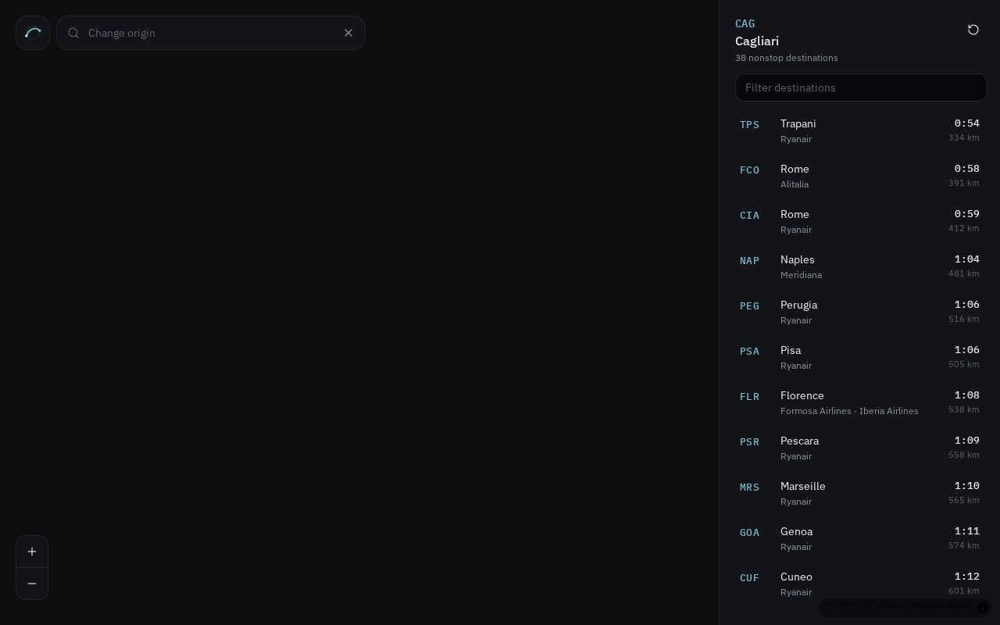

# Direct Flights

A dark, ad-free nonstop-route explorer. Search any airport, see every direct destination as animated great-circle arcs, and read airline, distance, and estimated duration in a sidebar (bottom sheet on mobile).

**Data is historical.** Routes come from [OpenFlights](https://openflights.org/data.html) (~2014 schedules). This is not a live timetable and must not be used for travel planning.

## Screenshots




## Features

- Full-screen MapLibre GL map, dark theme
- Airport search by IATA, city, or name (keyboard: `/` to focus, arrows, Enter, Escape)
- Animated great-circle arcs to every nonstop
- Destinations sorted by estimated block time (`h:mm`)
- Route detail on click (zoom to the pair)
- Mobile-first layout: search on top, sheet on the bottom

## Duration estimate

```
minutes = round(haversine_km / 850 km/h × 60 + 30)
```

Shown as `h:mm` (example: `1:45`). Never invented — only origin/destination pairs present in the cleaned OpenFlights dump are rendered.

## JSON contract

Build output lives in `public/data/`:

```
public/data/airports.json          # search index
public/data/routes/{IATA}.json     # nonstops from that origin
public/data/meta.json
```

`airports.json` is an array of:

```json
{
  "iata": "FCO",
  "name": "Leonardo da Vinci International Airport",
  "city": "Rome",
  "country": "Italy",
  "lat": 41.8002778,
  "lon": 12.2388889,
  "destinations": 156
}
```

`routes/{IATA}.json`:

```json
{
  "origin": "FCO",
  "destinations": [
    {
      "iata": "JFK",
      "name": "John F Kennedy International Airport",
      "city": "New York",
      "country": "United States",
      "lat": 40.639801,
      "lon": -73.7789,
      "km": 6870,
      "minutes": 515,
      "airlines": ["Alitalia"]
    }
  ]
}
```

Destinations are unique nonstops (codeshares and multi-stop legs dropped), sorted by `minutes`.

## Swap in a live provider

Keep the same files and field names. Point `scripts/build-openflights.ts` (or a new `scripts/build-live.ts`) at a live API and emit the identical JSON.

| Provider | Starting point |
| --- | --- |
| [AeroDataBox](https://aerodatabox.com/) | `GET /airports/iata/{iata}/direct-flights` (or the routes-by-airport endpoint in your plan). Map each destination IATA + operator name into `Destination`. |
| [Amadeus](https://developers.amadeus.com/) | `GET /v1/airport/direct-destinations?departureAirportCode=FCO`. Join airport metadata from Airport & City Search; airline names from Airline Code Lookup. |

Rebuild:

```bash
npm run data:build -- --force
```

Then deploy. The UI never invents routes; if a file is missing the origin shows an empty state.

## Deploy

Self-hosted VPS via GitHub Actions → GHCR → SSH. See [docs/deploy.md](docs/deploy.md).

```bash
# local production image
NITRO_PRESET=node-server docker build -t direct-flights .
docker run --rm -p 3080:3000 direct-flights
```

The container listens on port 3000. Compose binds it to `127.0.0.1:3080` behind your reverse proxy.

Repository secrets for CD: `SSH_HOST`, `SSH_USER`, `SSH_KEY` (optional `SSH_PORT`, `DEPLOY_PATH`).

## Setup

```bash
npm install
npm run data:build    # downloads OpenFlights dumps, writes public/data
npm run dev           # http://localhost:8080
npm test
npm run build
```

Node 22+. Map tiles are CARTO Dark Matter (OSM). No map API key required.

## Stack

Vite, React, TypeScript, Tailwind CSS v4, MapLibre GL JS. Static JSON, no backend.

## License

MIT. Airport and route data © [OpenFlights](https://openflights.org/data.html).
